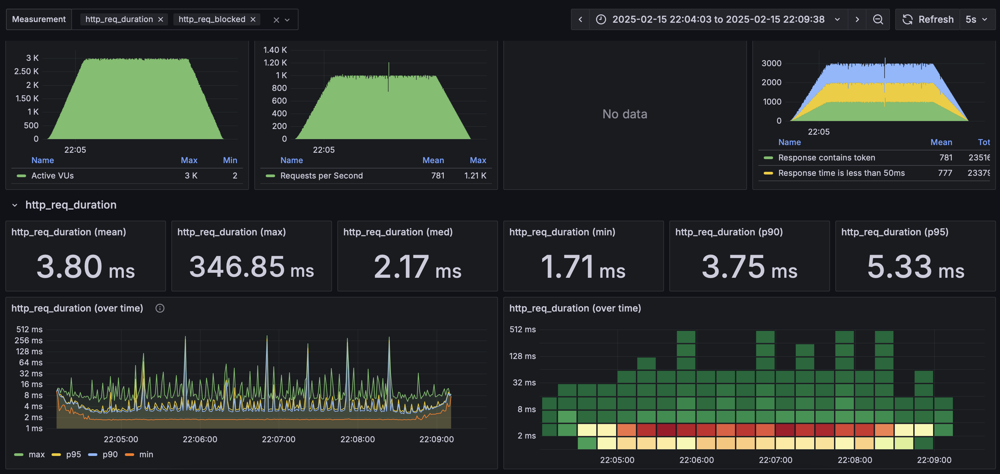
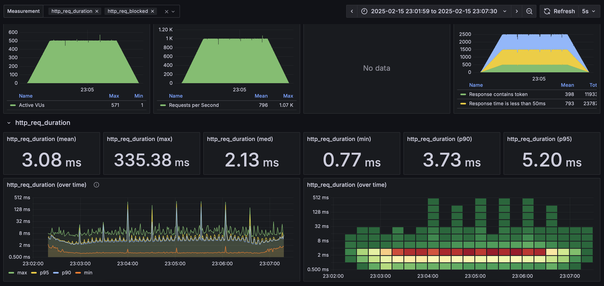
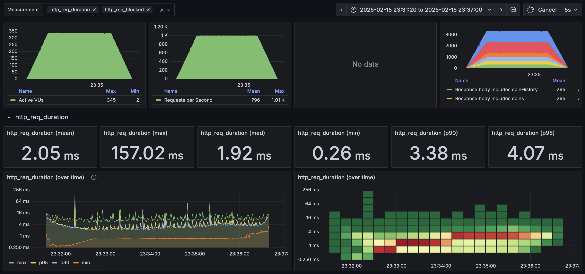
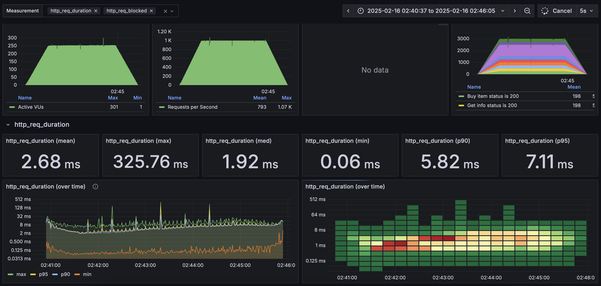

# Avito-Backend-trainee-assignment-winter-2025

## Инструкция по запуску
```
docker-compose up -d
```
сервис будет доступен на порту :8080

## Ключевые моменты
* стек: Go, PostgreSQL
* fiber
* pgx
* Graceful shutdown
* JWT авторизация
* использование транзакций
* явные блокировки строк (select ... for update)
* линтеры ([.golangci.yaml](./.golangci.yaml ".golangci.yaml"), [результат работы линтеров после пуша](https://github.com/Mx1q/Avito-Backend-trainee-assignment-winter-2025/actions/workflows/golangci-lint.yml "результат работы линтеров"))
* автоматический запуск тестов и линтеров перед коммитом ([lefthook](./lefthook.yml "конфиг lefthook"))
* логирование ошибок (zerolog)
* построение запросов к БД с использованием билдера (squirrel)

## Тесты ([результаты работы тестов после пуша](https://github.com/Mx1q/Avito-Backend-trainee-assignment-winter-2025/actions/workflows/go.yml "результаты работы тестов"))
* сервисы: покрытие 100% юнит тестами
* репозитории: покрытие 79.3% интеграционными тестами (testcontainers)
* обработчики: покрытие 77.4% e2e тестами (testcontainers), рассмотрены сценарии: покупки мерча, отправки монет, получения информации о монетах, инвентаре и истории транзакций и т.п.

Все тесты возможно запустить через make:
```
make
```

запсук отдельно юнит, интеграционных или e2e тестов:
```
make unit_tests
```

```
make integration_tests
```

```
make e2e_tests
```

## Нагрузочное тестирование
Для нагрузочного тестирования использовался k6.

Каждый тест проводился в следующем формате: за 1 минуту rps поднимается до 1000, 3 минуты поддерживается rps 1000, за последнюю минуту rps опускается до 0.

### /api/auth ([текст отчета](./load_testing/results/auth/auth_1k.txt))
* 99.80% запросов с временем ответа менее 50 мс. (см. checks)
* среднее время ответа 3.79 мс (см. http_req_duration - avg)
* медиана время ответа 2.16 мс (см. http_req_duration - med)
* 95% запросов с временем ответа менее 5.33 мс. (см. http_req_duration - p(95))
* успешность ответа 100% (см. http_req_failed)



### /api/auth + /api/buy/{item} ([текст отчета](./load_testing/results/auth_buy/auth_buy_1k.txt))
* 99.87% запросов с временем ответа менее 50 мс. (см. checks)
* среднее время ответа 3.08 мс (см. http_req_duration - avg)
* медиана время ответа 2.13 мс (см. http_req_duration - med)
* 95% запросов с временем ответа менее 5.2 мс. (см. http_req_duration - p(95))
* успешность ответа 100% (см. http_req_failed)



### /api/auth + /api/buy/{item} + /api/info ([текст отчета](./load_testing/results/auth_buy_info/auth_buy_info.txt))
* 99.99% запросов с временем ответа менее 50 мс. (см. checks)
* среднее время ответа 2.05 мс (см. http_req_duration - avg)
* медиана время ответа 1.91 мс (см. http_req_duration - med)
* 95% запросов с временем ответа менее 4.06 мс. (см. http_req_duration - p(95))
* успешность ответа 100% (см. http_req_failed)



### /api/auth + /api/buy/{item} + /api/sendCoin + /api/info ([текст отчета](./load_testing/results/auth_buy_sendCoin_info/auth_buy_send_info.txt))
* 99.97% запросов с временем ответа менее 50 мс. (см. checks)
* среднее время ответа 2.68 мс (см. http_req_duration - avg)
* медиана время ответа 1.91 мс (см. http_req_duration - med)
* 95% запросов с временем ответа менее 7.11 мс. (см. http_req_duration - p(95))
* успешность ответа 100% (см. http_req_failed, по умолчанию http_request_failed считает количество ответов с кодом 4ХХ или 5ХХ, однако, в случае попытки отправить монеты самому себе или при нехватке монет, код ответа - 400, поэтому в данном случае необходимо смотреть на проверки в начале отчета (Send coins status is 200 or 400) все проверки данного типа завершились успешно, значит сервер не отвечал 500 ошибкой и все запросы выполнились корректно)



### Запуск нагрузочных тестов

Запуск тестового окружения (в папке load_testing), grafana и influxdb - опционально:
```
docker compose up -d avito-shop-service db grafana influxdb
```

Запуск нагрузочного теста
```
docker compose up -d k6
```

> [!NOTE]
> Результаты тестов в логах контейнера k6
